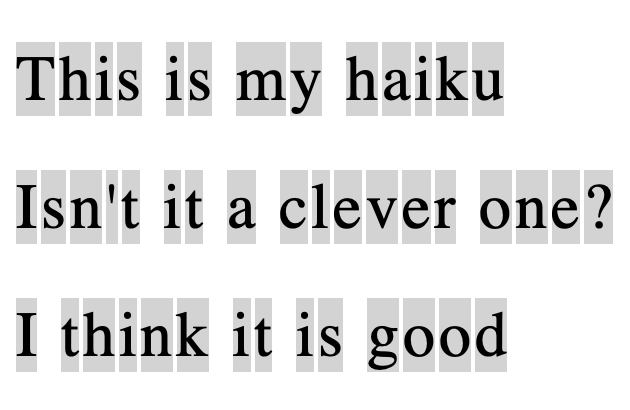
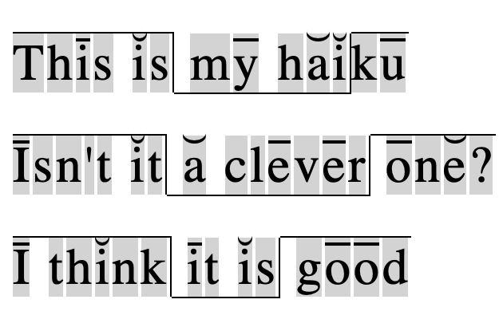
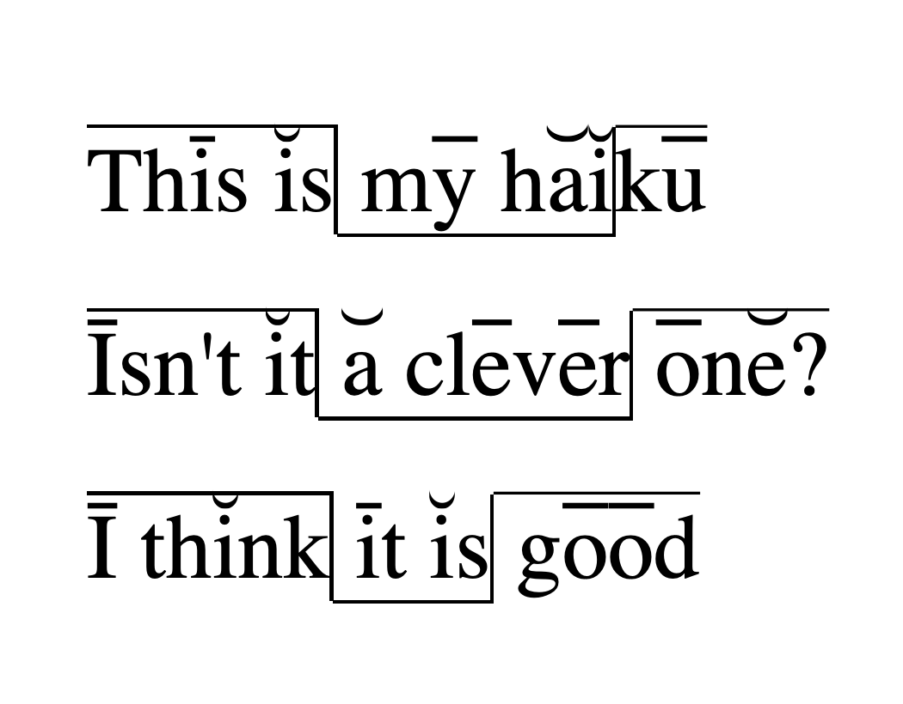

# braglidir

## Summary

**braglidir** is a web app for marking stressed and unstressed syllables (áhersluatkvæði & áherslulaus atkvæði) as well as *hákveður* and *lágkveður* (heavy foot & light foot, which denote emphasis), in Icelandic poetry.

## Usage

[**braglidir** on GitHub Pages](https://reyniraron.github.io/braglidir)

Once you load **braglidir** you will be asked to choose a file. Please choose poem in a plain text file (.txt).

Once you have chosen your poem, **braglidir** will read it and display it on the page.

To mark a stressed syllable (áhersluatkvæði), left click on the appropriate vowel. You can remove the mark the same way. Stressed syllables are marked with a straight underline.

To mark an unstressed syllable (áherslulaust atkvæði), right click or <kbd>Control</kbd>-click (Mac only) on the appropriate vowel.
You can remove the mark the same way. Unstressed syllables are marked with a downwards curved underline.

To split the poem into *kveður* (heavy feet and light feet), hold <kbd>Shift</kbd> and left click on the character (space or non-space) you want to be the last in said *kveða*. The first *kveða* in a line will always be a *hákveða* (heavy foot), and the following *kveður* will alternate between *lágkveða* and *hákveða*. To remove a *kveða*, hold <kbd>shift</kbd> and left click on any character within said *kveða*.

To mark *ljóðstafir*, hold <kbd>Shift</kbd> and right-click or <kbd>Control</kbd>-click (Mac only) on the appropriate character. You can remove the mark the same way. *Ljóðstafir* are marked with a bold font.

To mark *braghvíld* (cesura - a small pause), hold <kbd>Alt</kbd> (<kbd>Option</kbd> on a Mac) and click on the character you want the pause to come after. You can remove the mark the same way. Brahvíld is marked with two slashes (//).

## Saving output

**braglidir** is designed to output via your browser's print dialog. To save the output as a file, simply print the page to PDF. The gray background and space between characters will not be visible in the printed output.

## License

This project is licensed under the GNU General Public License v3.0. See repository LICENSE file for more details.
